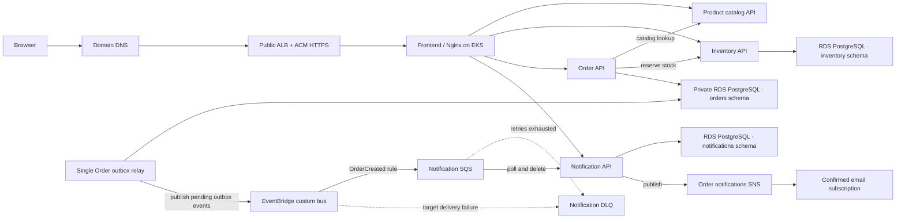
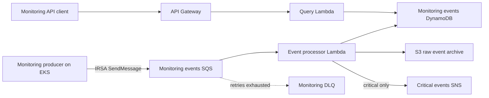

# Roast & Relay Coffee Store

The AWS platform and Terraform infrastructure for this application are documented in the [retail-microservices-eks-platform repository](https://github.com/oguduf/retail-microservices-eks-platform).

A local first Coffee Store built as five independently runnable components: a product catalog, inventory service, order service, notification service, and frontend. Docker Compose runs them together without AWS dependencies.

## Components

| Component | Owns | Local storage |
|---|---|---|
| Product Catalog | Coffee details, SKUs, roast profiles, and prices | Versioned JSON data owned by this service |
| Inventory | Available bag counts and order reservations | Its own SQLite database and Docker volume |
| Orders | Customer orders and order status | Its own SQLite database and Docker volume |
| Notifications | Order update records | Its own SQLite database and Docker volume |
| Frontend | Coffee browsing, ordering, order history, and updates | None; static web files served by Nginx |

Each backend runs in a separate container. The frontend uses Nginx to route API calls to the backend containers. The browser only needs to reach the frontend on port 8080.

## Repository layout

```text
.github/workflows/         CI, dev deployment, and security workflows
frontend/                  Storefront UI and Nginx API routing
services/product/          Product catalog API, data, and tests
services/inventory/        Inventory API and stock reservations
services/orders/           Order API, PostgreSQL-compatible storage, and DB bootstrap job
services/notifications/    Notification API and order updates
k8s/                       Local Kubernetes manifests
helm/coffee-store/         AWS/EKS Helm chart, service standards, HPA, ingress, and DB bootstrap Job
docker-compose.yml         Local multi-container development setup
```

Each service directory also contains its Dockerfile and Python dependencies. The AWS deployment workflow uses the Helm chart under `helm/coffee-store/`; the chart creates its namespace and connects the three stateful services to private RDS PostgreSQL.

| Workflow | Purpose |
|---|---|
| `.github/workflows/ci.yml` | Runs application tests, Helm validation, and local container image scans on pushes and pull requests. |
| `.github/workflows/security.yml` | Scans history, dependencies, and configuration on pushes and pull requests. |
| `.github/workflows/deploy-aws-dev.yml` | Manually verifies both checks for the dev commit, publishes scanned images to ECR, and deploys them to EKS. |

## Local run

Start Docker Desktop, then from this repository root run:

```powershell
docker compose up --build
```

Open <http://localhost:8080>. Stop the app with `Ctrl+C` in that terminal. The named volumes keep inventory, orders, and notification records when containers restart. `docker compose down -v` deletes that local data, so use it only when you want a clean reset.

## Local Kubernetes run (Docker Desktop)

The manifests in `k8s/` deploy the same five components to the local Docker Desktop Kubernetes cluster in the `coffee-store` namespace. Kubernetes uses separate SQLite databases from Docker Compose; the two environments do not share orders or inventory. These local-only manifests use preloaded `:dev` images with `imagePullPolicy: Never`; their Checkov annotations document the local exception. The AWS template uses `Always` and the deployment workflow injects the immutable ECR digest.

From the repository root, build the images, tag them for this local deployment, and load them into the Docker Desktop kind cluster (here the cluster name is `desktop`):

```powershell
docker compose build
docker image tag retail-application-frontend:latest retail-application-frontend:dev
docker image tag retail-application-product-service:latest retail-application-product-service:dev
docker image tag retail-application-inventory-service:latest retail-application-inventory-service:dev
docker image tag retail-application-order-service:latest retail-application-order-service:dev
docker image tag retail-application-notification-service:latest retail-application-notification-service:dev
kind load docker-image retail-application-frontend:dev retail-application-product-service:dev retail-application-inventory-service:dev retail-application-order-service:dev retail-application-notification-service:dev --name desktop
kubectl apply -f k8s/00-namespace.yaml
kubectl apply -f k8s/10-storage.yaml
kubectl apply -f k8s/20-application.yaml
kubectl get pods,services,pvc -n coffee-store
```

When all five Pods are ready and the PVCs are `Bound`, expose the frontend from a separate PowerShell window:

```powershell
kubectl port-forward -n coffee-store service/frontend 8081:80
```

Open <http://localhost:8081>. Keep the port-forward command running while using the app; `Ctrl+C` stops only that forwarding process. The Kubernetes PVCs use Docker Desktop's local-path `standard` StorageClass. This is suitable for a local lab, not durable production storage or multi-node database availability; production should use managed databases and an appropriate backup/recovery plan.

## AWS development deployment

The AWS deployment is separate from Docker Desktop. `Coffee Store CI` runs automatically on pushes and pull requests to `dev` and `main`: it tests the services, validates the Helm chart, and builds and scans all five images without AWS credentials. `Security checks` runs separately. To deploy, manually run `Deploy Coffee Store to EKS` from the `dev` branch. It requires successful CI and security push runs for that exact commit, rebuilds and scans the images, pushes them to ECR, and deploys their immutable digests with Helm. It then verifies the rollouts and frontend routes.

Configure repository variables `AWS_REGION`, `AWS_ROLE_ARN`, `EKS_CLUSTER_NAME`, `PROJECT_NAME`, `ENVIRONMENT`, `ACM_CERTIFICATE_ARN`, `DOMAIN_NAME`, `ORDER_EVENT_BUS_NAME`, `ORDER_NOTIFICATION_QUEUE_URL`, `ORDER_NOTIFICATION_TOPIC_ARN`, `ORDER_SERVICE_ROLE_ARN`, `ORDER_DB_MIGRATOR_ROLE_ARN`, `INVENTORY_SERVICE_ROLE_ARN`, `NOTIFICATION_SERVICE_ROLE_ARN`, `ORDERS_DATABASE_HOST`, and `ORDERS_DATABASE_SECRET_ARN`. Terraform outputs provide the role ARNs, private database endpoint, and master-secret ARN; copy those non-password values into GitHub repository variables after applying infrastructure. The deploy role must trust this repository's GitHub Actions OIDC subject and allow ECR image pushes, `eks:DescribeCluster`, and Kubernetes access to the `coffee-store` namespace. Non-AWS pods do not mount Kubernetes API credentials; IRSA-enabled Order, Inventory, Notification, and migration pods receive the projected web-identity token required for their scoped roles.

AWS uses one private, encrypted PostgreSQL RDS instance with separate `orders`, `inventory`, and `notifications` schemas. Each service receives a distinct IAM-authenticated database role (`orders_app`, `inventory_app`, or `notifications_app`) through its own IRSA identity; only the one-shot schema bootstrap Job can read the RDS-managed master secret. Local development continues to use SQLite. The workflow installs Metrics Server for CPU-based HPAs and the Vertical Pod Autoscaler. Product, Inventory, Orders, Notifications, and Frontend scale from one to three replicas based on CPU; VPA adjusts memory requests and limits within per-service bounds. The Order outbox relay remains a singleton and VPA may tune its CPU and memory, preventing duplicate publishers while adapting resource sizing. The platform repo separately installs Karpenter to add and consolidate bounded EC2 nodes when Pods cannot fit. This remains a lab: RDS Multi-AZ is configurable but off by default, the destroy path skips a final snapshot, and one baseline EKS node is a single point of failure.

On AWS, a placed order and its outbox event are saved together in RDS. The single Order outbox relay retries publishing events to EventBridge using its IRSA role; EventBridge routes `OrderCreated` events to the notification SQS queue. The Notification service consumes the queue, records the update for the UI, then publishes a message to the order-notifications SNS topic. Failed messages are retried by SQS and eventually sent to its DLQ. This path is at-least-once: a rare retry after an ambiguous network failure may publish a duplicate SNS message. An optional SNS email subscription can be configured with Terraform; the recipient must confirm the subscription.

### Customer order architecture



Each stateful service connects to its own schema and database role. The Order outbox relay remains a singleton to avoid competing EventBridge publishers. SQS delivery is at-least-once, so downstream processing must tolerate retries. CPU HPA and memory VPA are intentionally split so both controllers do not manage the same resource metric. CPU-based HPA is not a direct queue-backlog signal; a production notification consumer would usually scale on queue depth or message age using an external-metrics adapter such as KEDA.

### Monitoring architecture



The monitoring pipeline stores operational events. It does not store coffee orders or inventory in the monitoring DynamoDB table.

The `Security checks` workflow runs Gitleaks on Git history, Checkov on configuration, and Trivy on dependencies and configuration for pushes and pull requests. Manual AWS deployment requires successful CI and security runs for the selected commit, then scans each rebuilt container image with Trivy before pushing it to ECR. A failing scan stops deployment; review and fix the finding rather than bypassing the gate.

## Local request flow

```text
Browser → Frontend/Nginx
            ├── Catalog API → Product Catalog
            ├── Inventory API → Inventory
            ├── Orders API → Orders → Product Catalog + Inventory
            │                              └── local: best-effort HTTP update → Notifications
            └── Notifications API → Notifications
```

The local Docker and Kubernetes environments use a best-effort HTTP notification call after saving an order. The AWS deployment uses the asynchronous EventBridge/SQS/SNS path described above, so the order service does not synchronously depend on notification delivery.

## API endpoints

| Service | Endpoint | Purpose |
|---|---|---|
| Product Catalog | `GET /api/catalog` | List coffee products |
| Product Catalog | `GET /api/catalog/{sku}` | Get a coffee by SKU |
| Inventory | `GET /api/inventory` | List stock counts |
| Orders | `POST /api/orders` | Place an order and reserve stock |
| Orders | `GET /api/orders` | List recent orders |
| Notifications | `GET /api/notifications` | List order updates |

The backend services also expose `/health` within the Compose network.

## Development scope

The app uses sample catalog data and SQLite for local development. All three AWS stateful services use private RDS PostgreSQL, IAM database authentication, and separate schemas/roles; the local services continue using SQLite so Docker Compose needs no AWS credentials. AWS event-driven notifications use EventBridge/SQS/SNS. Payments and customer-facing authentication remain out of scope. Each service owns its API boundary and receives a narrowly scoped IRSA role.
