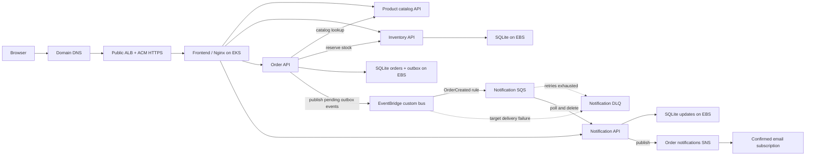
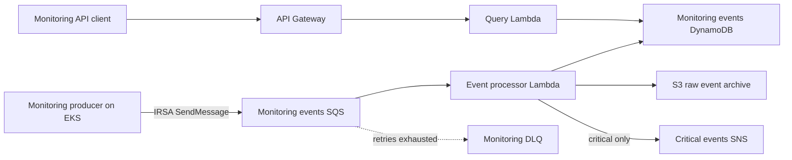

# Roast & Relay Coffee Store

A local first Coffee Store built as five independently runnable components: a product catalog, inventory service, order service, notification service, and frontend. Docker Compose runs them together without AWS dependencies.

## Components

| Component | Owns | Local storage |
|---|---|---|
| Product Catalog | Coffee details, SKUs, roast profiles, and prices | Versioned JSON data owned by this service |
| Inventory | Available bag counts and order reservations | Its own SQLite database and Docker volume |
| Orders | Customer orders and order status | Its own SQLite database and Docker volume |
| Notifications | Order update records | Its own SQLite database and Docker volume |
| Frontend | Coffee browsing, ordering, order history, and updates | None; static web files served by Nginx |

Each backend runs in a separate container. The frontend uses Nginx to route API calls to the backend containers. The browser only needs to reach the frontend on port 8080.

## Local run

Start Docker Desktop, then from this repository root run:

```powershell
docker compose up --build
```

Open <http://localhost:8080>. Stop the app with `Ctrl+C` in that terminal. The named volumes keep inventory, orders, and notification records when containers restart. `docker compose down -v` deletes that local data, so use it only when you want a clean reset.

## Local Kubernetes run (Docker Desktop)

The manifests in `k8s/` deploy the same five components to the local Docker Desktop Kubernetes cluster in the `coffee-store` namespace. Kubernetes uses separate SQLite databases from Docker Compose; the two environments do not share orders or inventory. These local-only manifests use preloaded `:dev` images with `imagePullPolicy: Never`; their Checkov annotations document the local exception. The AWS template uses `Always` and the deployment workflow injects the immutable ECR digest.

From the repository root, build the images, tag them for this local deployment, and load them into the Docker Desktop kind cluster (here the cluster name is `desktop`):

```powershell
docker compose build
docker image tag retail-application-frontend:latest retail-application-frontend:dev
docker image tag retail-application-product-service:latest retail-application-product-service:dev
docker image tag retail-application-inventory-service:latest retail-application-inventory-service:dev
docker image tag retail-application-order-service:latest retail-application-order-service:dev
docker image tag retail-application-notification-service:latest retail-application-notification-service:dev
kind load docker-image retail-application-frontend:dev retail-application-product-service:dev retail-application-inventory-service:dev retail-application-order-service:dev retail-application-notification-service:dev --name desktop
kubectl apply -f k8s/00-namespace.yaml
kubectl apply -f k8s/10-storage.yaml
kubectl apply -f k8s/20-application.yaml
kubectl get pods,services,pvc -n coffee-store
```

When all five Pods are ready and the PVCs are `Bound`, expose the frontend from a separate PowerShell window:

```powershell
kubectl port-forward -n coffee-store service/frontend 8081:80
```

Open <http://localhost:8081>. Keep the port-forward command running while using the app; `Ctrl+C` stops only that forwarding process. The Kubernetes PVCs use Docker Desktop's local-path `standard` StorageClass. This is suitable for a local lab, not durable production storage or multi-node database availability; production should use managed databases and an appropriate backup/recovery plan.

## AWS development deployment

The AWS deployment is separate from the Docker Desktop manifests. It builds and scans all five images, pushes them to the existing ECR repositories, captures each registry digest, and deploys the digest-pinned images to the existing EKS cluster when the `Build and deploy Coffee Store to EKS` workflow is manually run. The AWS pods disable automatic Kubernetes API token mounting; order and notification AWS access still uses the EKS IRSA webhook's projected STS token. Configure the repository variables `AWS_REGION`, `AWS_ROLE_ARN`, `EKS_CLUSTER_NAME`, `PROJECT_NAME`, `ENVIRONMENT`, `ACM_CERTIFICATE_ARN`, `DOMAIN_NAME`, `ORDER_EVENT_BUS_NAME`, `ORDER_NOTIFICATION_QUEUE_URL`, `ORDER_NOTIFICATION_TOPIC_ARN`, `ORDER_SERVICE_ROLE_ARN`, and `NOTIFICATION_SERVICE_ROLE_ARN` first. The AWS role must trust this repository's GitHub Actions OIDC subject and allow ECR image pushes, `eks:DescribeCluster`, and Kubernetes access to the `coffee-store` namespace.

The AWS manifests use the EKS EBS CSI add-on and encrypted `gp3` EBS volumes for the three SQLite-backed services. Each stateful service stays at one replica and uses a `Recreate` rollout to avoid concurrent attachment of a single-writer volume. The Ingress configures a public Application Load Balancer with HTTP-to-HTTPS redirect using the supplied ACM certificate and hostname. Create the apex DNS alias at the DNS provider to point `DOMAIN_NAME` to the ALB address produced by the Ingress. These settings are a development/lab deployment, not a highly available production data architecture: EBS volumes are zonal, SQLite is single-writer, and volume snapshots/backups are not configured here.

On AWS, a placed order is saved together with an outbox event. The Order service retries publishing that event to EventBridge using its IRSA role; EventBridge routes `OrderCreated` events to the notification SQS queue. The Notification service consumes the queue, records the update for the UI, then publishes a message to the order-notifications SNS topic. Failed messages are retried by SQS and eventually sent to its DLQ. This path is at-least-once: a rare retry after an ambiguous network failure may publish a duplicate SNS message. An optional SNS email subscription can be configured with Terraform; the recipient must confirm the subscription.

### Customer order architecture



The order service calls inventory directly. No inventory SQS consumer is deployed; the unused inventory queue and target are slated for removal through a reviewed Terraform plan.

### Monitoring architecture



The monitoring pipeline stores operational events. It does not store coffee orders or inventory in the monitoring DynamoDB table.

The `Security checks` workflow runs Gitleaks on Git history, Checkov on configuration, and Trivy on dependencies and configuration for pushes and pull requests. Manual AWS deployment waits for the same checks and scans each built container image with Trivy before pushing it to ECR. A failing scan stops deployment; review and fix the finding rather than bypassing the gate.

## Local request flow

```text
Browser → Frontend/Nginx
            ├── Catalog API → Product Catalog
            ├── Inventory API → Inventory
            ├── Orders API → Orders → Product Catalog + Inventory
            │                              └── local: best-effort HTTP update → Notifications
            └── Notifications API → Notifications
```

The local Docker and Kubernetes environments use a best-effort HTTP notification call after saving an order. The AWS deployment uses the asynchronous EventBridge/SQS/SNS path described above, so the order service does not synchronously depend on notification delivery.

## API endpoints

| Service | Endpoint | Purpose |
|---|---|---|
| Product Catalog | `GET /api/catalog` | List coffee products |
| Product Catalog | `GET /api/catalog/{sku}` | Get a coffee by SKU |
| Inventory | `GET /api/inventory` | List stock counts |
| Orders | `POST /api/orders` | Place an order and reserve stock |
| Orders | `GET /api/orders` | List recent orders |
| Notifications | `GET /api/notifications` | List order updates |

The backend services also expose `/health` within the Compose network.

## Development scope

The app currently uses sample catalog data and SQLite storage. AWS event-driven order notifications are implemented for the AWS deployment; authentication, payment processing, and production database migrations remain future work. Each service owns its API boundary, and AWS service access uses separate IRSA roles for the order publisher and notification consumer.
